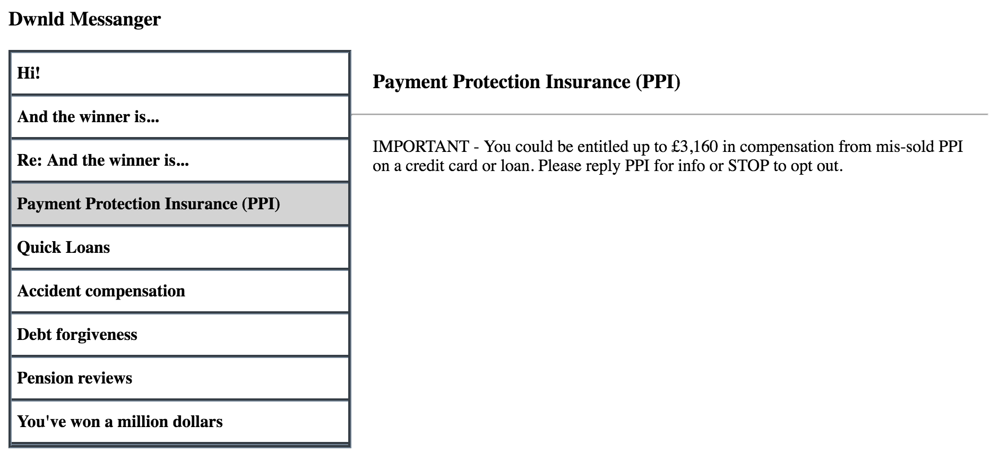

# dwnld take-home interview

Hi! We are so glad that you've decided to take on this interview with us. Here are the steps to get started.

1. You will need Node.js and NPM. Install them if you haven't already.
2. Clone this repository, and go to the directory.
3. Run `npm install`
4. Run `npm run start`

The last command will start up a server on your local port 3000. Go to it, and
you should see a placeholder page. The watch command also sets up monitoring of
any changes to the JS files in the `lib` directory. The file `lib/app.js` is the
entry point, and it has already been included in the HTML file.

We are building an application to view messages. The requirements are to display a
list of messages. The user can click on each to view the body. It can look like the 
following, but be as creative as possible. This is only here to get you started and
is pretty bare bones.




The server has been set up with these endpoints for you 

Get all messages
* `/api/messages`
```javascript
[
  {
     id:<integer>,
     subject:<string>
  }
]
```

Get body of message for the id 
* `/api/messages/:messageId`

```javascript
{
  subject:<string>,
  body:<string>
}
```

Some rules for this interview:

- You're welcome to use any open source Javascript libraries.
- You're welcome to use Stack Overflow, but cite your sources.
- CSS libraries/frameworks are *NOT* allowed.

